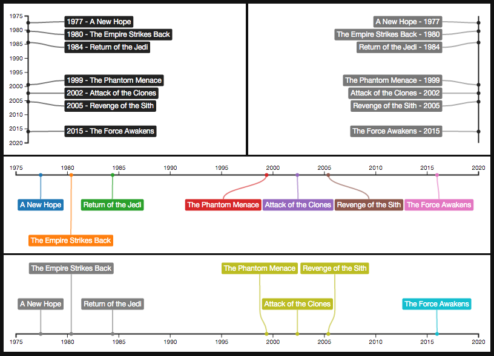

**Introduction** |
[Demo](http://kristw.github.io/d3kit-timeline) |
[API Reference](docs/api.md)

# d3Kit-timeline [![NPM version][npm-image]][npm-url] [![Dependency Status][daviddm-image]][daviddm-url]

If you want to have a simple timeline that labels do not overlap, but too lazy to implement one from scratch, this library is for you. Below is a screenshot of four timelines of the same data, each can be created via ~10 lines of code. [See demo.](http://kristw.github.io/d3kit-timeline)

The use case of this library is not limited to temporal data. You can change the scale to be d3.scale.linear() or something else to support x-value that is not time.

This small library is built on top of [D3](http://d3js.org/), [d3Kit](https://github.com/twitter/d3kit) and [Labella.js](https://github.com/twitter/labella.js).

<p align="center">
  <a href="http://kristw.github.io/d3kit-timeline/" style="width:100%;">
    
  </a>
</p>

Note: If you are upgrading from v0.x.x to v1.x.x, this library now return the constructor `d3KitTimeline` instead of `d3Kit`. Please see the [change logs](CHANGELOG.md) for more detail.

### Install

```
npm install d3kit-timeline --save
```

or

```
bower install d3kit-timeline --save
```

### Example Usage

If you have this dataset

```javascript
var data = [
  {time: new Date(1977, 4,25), episode: 4, name: 'A New Hope'},
  {time: new Date(1980, 4,17), episode: 5, name: 'The Empire Strikes Back'},
  {time: new Date(1984, 4,25), episode: 6, name: 'Return of the Jedi'},
  {time: new Date(1999, 4,19), episode: 1, name: 'The Phantom Menace'},
  {time: new Date(2002, 4,16), episode: 2, name: 'Attack of the Clones'},
  {time: new Date(2005, 4,19), episode: 3, name: 'Revenge of the Sith'},
  {time: new Date(2015,11,18), episode: 7, name: 'The Force Awakens'},
];
```

Here is how to create a timeline with labels on the right.

```javascript
var chart = new d3KitTimeline('#timeline', {
  direction: 'right',
  initialWidth: 400,
  initialHeight: 250,
  textFn: function(d){
    return d.time.getFullYear() + ' - ' + d.name;
  }
});

chart.data(data).resizeToFit();
```

For more detailed usage please refer to the [API Reference](docs/api.md).

### Import to your project

##### Choice 1. Global

Adding this library via ```<script>``` tag is the simplest way. By doing this, ```d3KitTimeline``` is available in the global scope.

```html
<script src="bower_components/d3/d3.min.js"></script>
<script src="bower_components/d3kit/dist/d3kit.min.js"></script>
<script src="bower_components/labella/dist/labella.min.js"></script>
<script src="bower_components/d3kit-timeline/dist/d3kit-timeline.min.js"></script>
```

##### Choice 2: AMD

If you use requirejs, this library support AMD out of the box.

```javascript
require.config({
  paths: {
    d3:    'path/to/d3',
    d3kit: 'path/to/d3Kit',
    labella: 'path/to/labella',
    'd3kit-timeline': 'path/to/d3kit-timeline'
  }
});
require(['d3kit-timeline'], function(d3KitTimeline) {
  // do something with d3KitTimeline
});
```

##### Choice 3: node.js / browserify

d3kit-timeline also supports usage in commonjs style.

```javascript
var d3KitTimeline = require('d3kit-timeline');
```

### Author

Krist Wongsuphasawat / [@kristw](https://twitter.com/kristw)

Copyright 2015-2017 Krist Wongsuphasawat.
Licensed under the [Apache License Version 2.0](http://www.apache.org/licenses/LICENSE-2.0)

[npm-image]: https://badge.fury.io/js/d3kit-timeline.svg
[npm-url]: https://npmjs.org/package/d3kit-timeline
[daviddm-image]: https://david-dm.org/kristw/d3kit-timeline.svg?theme=shields.io
[daviddm-url]: https://david-dm.org/kristw/d3kit-timeline
